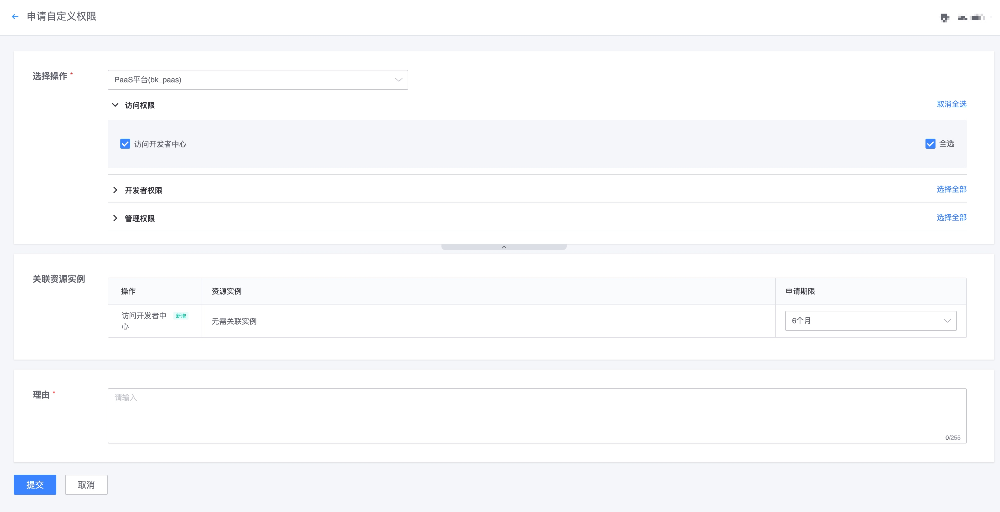

# 样例 1: 无关联实例权限

## 1. 场景描述

这类权限不关联任何实例, 属于`管理`类权限, 例如: 
- 能否访问某个入口, 例如能否访问开发者中心
- 是否是某个角色, 例如 管理员

## 2. 权限分析

- 不关联任何实例
- 意味着,  只是单纯一个`操作`
- 用户如果有权限, 那么权限中心会存在`用户-操作`的一条记录(如果查找不到, 代表用户没权限)

## 3. 权限模型

- 注意: 只需要注册一个`不关联任何resourceType`的`action`即可
- 即: `action` 的 `related_resource_types`为空列表`[]`
- [操作(Action) API](../../Reference/API/02-Model/13-Action.md)

```json
{
  "id": "access_developer_center",
  "name": "访问开发者中心",
  "name_en": "access developer center",
  "description": "一个用户是否能访问开发者中心",
  "description_en": "Is allowed to access the developer center",
  "type": "create",
  "related_resource_types": [],
  "version": 1
}
```

- 注册之后的权限配置页面



## 4. 鉴权

### 4.1 使用 SDK 进行鉴权

```python
from iam import IAM, Request, Subject, Action, Resource


SYSTEM_ID = "demo"
APP_CODE = "demo"
APP_SECRET = "c2cfbc92-28a2-420c-b567-cf7dc33cf29f"
BK_IAM_HOST = "http://{IAM_HOST}"
BK_PAAS_HOST = ''


class Permission(object):
    def __init__(self):
        self._iam = IAM(APP_CODE, APP_SECRET, BK_IAM_HOST, BK_PAAS_HOST)

    def _make_request_without_resources(self, username, action_id):
        request = Request(
            SYSTEM_ID,
            Subject("user", username),
            Action(action_id),
            None,
            None,
        )
        return request

    def allowed_access_developer_center(self, username):
        """
        访问开发者中心权限
        """
        request = self._make_request_without_resources(username, "access_developer_center")
        return self._iam.is_allowed(request)

# 使用
# Permission().allowed_access_developer_center(request.user.username)
```

### 4.2 使用直接鉴权 API 进行鉴权

- [直接鉴权 API: policy auth](../../Reference/API/04-Auth/02-DirectAPI.md)

```bash
curl -XPOST 'http://{IAM_HOST}/api/v1/policy/auth' \
-H 'X-Bk-App-Code: demo' \
-H 'X-Bk-App-Secret: c2cfbc92-28a2-420c-b567-cf7dc33cf29f' \
-H 'Content-Type: application/json' \
-d '{
  "action": {
    "id": "access_developer_center"
  },
  "system": "demo",
  "resources": [],
  "subject": {
    "type": "user",
    "id": "testuser1"
  }
}'


{
  "code": 0,
  "message": "ok",
  "data": {
    "allowed": false
  }
}
```

## 5. 无权限申请

在前端展示用户无权限的相关列表, 当用户点击`去申请`按钮时, 需要跳转到权限中心申请对应权限.

接入系统需要提前将相关数据到权限中心生成一个`权限申请URL`, 引导用户跳转过去申请对应权限. [生成无权限申请 URL](../../Reference/API/05-Application/01-GenerateURL.md)

具体的 [无权限交互方案](../NoPermissionApply.md)


```python
from iam.apply.models import ActionWithoutResources, ActionWithResources, Application, RelatedResourceType
from iam.apply.models import ResourceInstance, ResourceNode

class Permission(object):
    def __init__(self):
        self._iam = IAM(APP_CODE, APP_SECRET, BK_IAM_HOST, BK_PAAS_HOST)

    def make_no_resource_application(self, action_id):
        # 1. make application
        action = ActionWithoutResources(action_id)
        actions = [action]

        application = Application(SYSTEM_ID, actions)
        return application

    def generate_apply_url(self, bk_token, application):
        """
        处理无权限 - 跳转申请列表
        """
        # 2. get url
        ok, message, url = self._iam.get_apply_url(application, bk_token)
        if not ok:
            logger.error("iam generate apply url fail: %s", message)
            return IAM_APP_URL
        return url
        
# 使用        
# bk_token从cookie中获取, 测试时可以使用Chrome浏览器登录蓝鲸, F12, Application-Storage-Coolies复制bk_token
# access_application = make_no_resource_application("access_developer_center")
# url = Permission().generate_apply_url(bk_token, access_application)
```