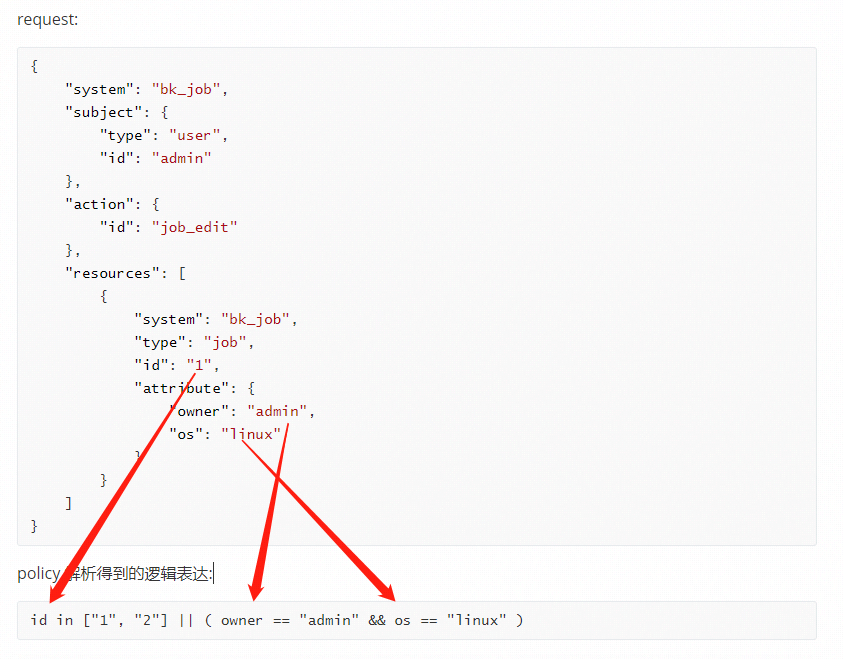

# 表达式求值

假设返回的条件表达式是:

```json
{
    "op": "OR",
    "content": [
        {
            "op": "OR",
            "field": "job.id",
            "value": ["1", "2"]
        },
        {
            "op": "AND",
            "content": [
                {
                    "op": "eq",
                    "field": "job.owner",
                    "value": "admin"
                },
                {
                    "op": "eq",
                    "field": "job.os",
                    "value": "linux"
                }
            ]
        }
    ]
}
```

以上表达式等价的布尔运算:

```bash
id in ["1", "2"] || ( owner == "admin" && os == "linux" )
```

表达式求值的过程, 就是将`资源`及其`属性`带入计算, 求表达式的`值`



以上请求最终鉴权计算结果为 true

----

具体表达式求值的实现可以参考 sdk 实现
- [Python SDK eval](https://github.com/TencentBlueKing/iam-python-sdk/tree/master/iam/eval)
- [Python SDK eval unittest cases](https://github.com/TencentBlueKing/iam-python-sdk/tree/master/tests/eval)