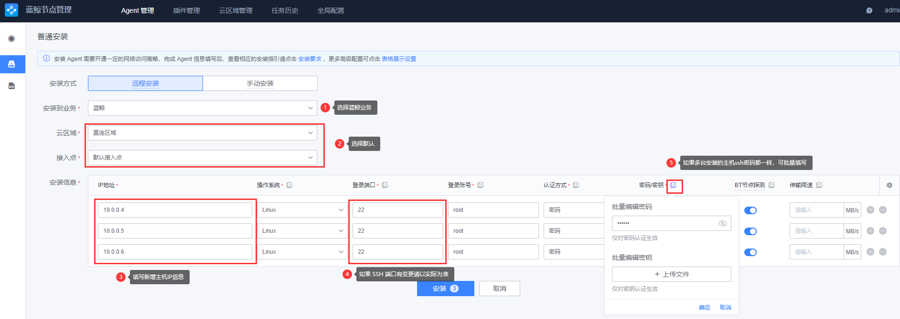
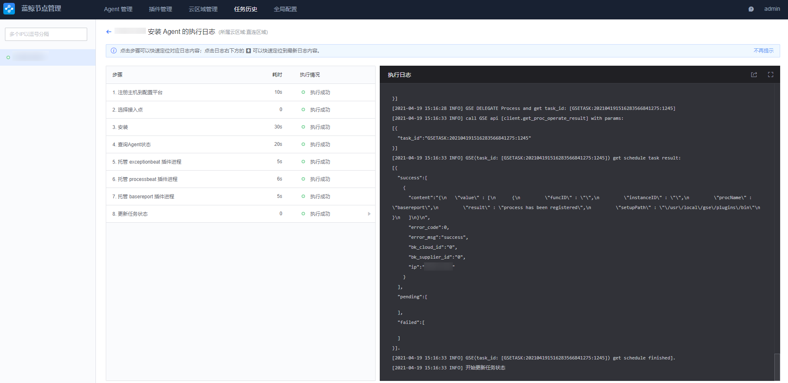
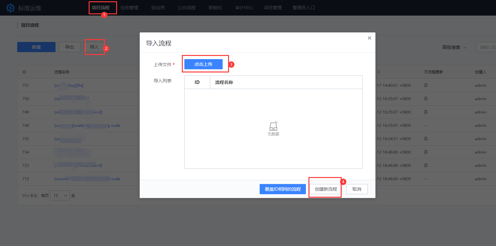
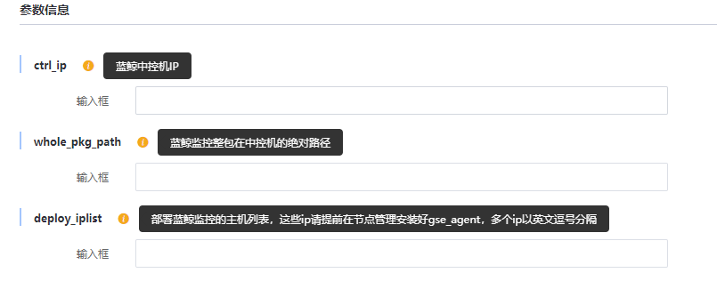
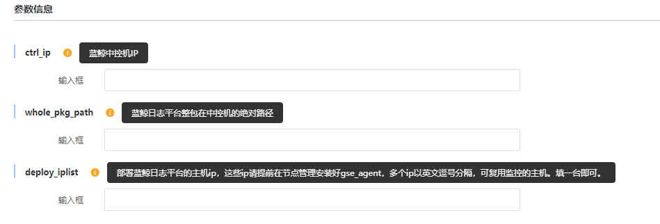
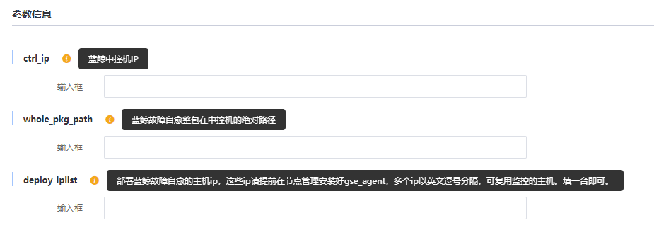

# 监控日志套餐安装指引

> 该套餐属于蓝鲸社区版增强套餐，请确认 **基础套餐** 是否已经部署完成；如未部署请参考 [基础套餐部署](./detail_install.md)。

该套餐主要适用于监控告警、日志采集分析以及故障自愈的场景。

主要包含蓝鲸相关产品：监控平台、日志平台、故障自愈。

## 前期准备

> 说明：因模块间存在依赖关系，需按照顺序依次部署： `监控平台 -> 日志平台 -> 故障自愈`。

该套餐部署是通过标准运维流程实现，在部署前需要做如下准备：

### 1.准备机器

> 为了保证环境的稳定，建议增强套餐独立于基础套餐的机器资源。

- 建议操作系统： CentOS 7.6 及以上
  - 建议机器配置
    - 生产环境：建议 8 核 16 G，硬盘 100G 以上（可根据实际情况适当调整配置），机器数量：3 台
    - 功能体验：建议 8 核 16 G，机器数量：1 台

### 2.实现免密

开始部署前，请确保新增主机跟中控机已实现免密。

```bash
ssh-copy-id <ip>
```

### 3.请先前往节点管理，对新增主机进行 agent 安装

- 前往节点管理进行安装，根据图中步骤填写相关信息。
  


- 安装成功示意图，如果失败请解决报错后再进行重试或者重装。



### 4.下载套餐安装包

请前往 [蓝鲸官网下载页](https://bk.tencent.com/download/) 下载监控日志套餐软件包并上传至中控机解压。

```bash
cd /data
tar xf bkce_co_package-6.0.4.tgz
```

### 5.将需要部署产品的标准运维流程模版导入至标准运维

   标准运维流程模版 [下载](https://bkopen-1252002024.file.myqcloud.com/ce/bk_sops_co_package-6.0.4.dat)

   **详细步骤：** `打开标准运维 -> 项目流程 -> 导入 -> 点击上传 -> 创建新流程`

   

   假设需要部署的 `监控日志套餐包` 已放置中控机的 `/data` 目录 ，`对应套餐包的标准运维流程模版` 已导入至标准运维。导入可参考如下:

   

### 6.检查 install.config

检查 install.config 文件是否已经包含增强套餐的相关模块分布，如果有请先移除相关模块。如无输出则可继续往下操作。

```bash
value_modules=(es7 monitorv3\(influxdb-proxy\) monitorv3\(monitor\) monitorv3\(grafana\) influxdb\(bkmonitorv3\) monitorv3\(transfer\) fta beanstalk log\(grafana\) log\(api\) kafka\(config\))

for module in ${value_modules[@]}; do if grep ${module} /data/install/install.config >/dev/null; then echo -e "The \e[1;31m ${module} \e[0m module exists in install.config, please remove it before deploying."; fi; done
```

### 7. 检查主机名

检查新增机器的主机名是否与基础环境机器的主机名是否有冲突。如有冲突，请先进行修改，如无请忽略。

```
hostname
```

## 开始部署

### 监控平台

选择 `[ce][deploy][bkmonitorv3]` 流程模版进行新建任务，根据提示填写相关信息。确认填写信息无误后，开始执行任务。

填写信息包括：

- `ctrl_ip`：基础环境的中控机 IP
- `whole_pkg_path`：部署监控平台安装包的绝对路径
- `deply_iplist`：新增的机器 IP（如果基础环境的资源有富余，可以复用）



该部署流程主要相关操作：

- 将监控平台安装包放至指定目录
- 生成监控平台 install.config 配置
- 初始化新增节点机器
- 授权监控平台所需的 MySQL 访问权限
- 安装监控相关依赖、监控平台后台、监控平台 SaaS

> 详细安装过程介绍，请查看[安装监控平台详解](../../基础包安装/安装详解/install_bkmonitorv3.md)。

### 日志平台

选择 `[ce][deploy][bklog]` 流程模版进行新建任务，根据提示填写相关信息。确认填写信息无误后，开始执行任务。

填写信息包括：

- `ctrl_ip`：基础环境的中控机 IP
- `whole_pkg_path`：部署日志平台安装包的绝对路径 
- `deply_iplist`：新增的机器 IP（如果基础环境的资源有富余，可以复用）



该部署流程主要相关操作：

- 将日志平台安装包放至指定目录
- 生成日志平台 install.config 配置
- 初始化新增节点机器
- 授权日志平台所需的 MySQL 访问权限
- 安装日志平台相关依赖、日志平台后台、日志平台 SaaS

> 详细安装过程介绍，请查看 [安装日志平台详解](../../基础包安装/安装详解/install_bkmonitorv3.md)。

### 故障自愈

选择 `[ce][deploy][fta]` 流程模版进行新建任务，根据提示填写相关信息。确认填写信息无误后，开始执行任务。

该部署流程主要相关操作：

- `ctrl_ip`：基础环境的中控机 IP
- `whole_pkg_path`：部署故障自愈安装包的绝对路径
- `deply_iplist`：新增的机器 IP（如果基础环境的资源有富余，可以复用）



主要会做相关操作：

- 将故障自愈安装包放至指定目录
- 生成故障自愈 install.config 配置
- 初始化新增节点机器
- 授权故障自愈所需的 MySQL 访问权限
- 安装故障自愈相关依赖、故障自愈后台、故障自愈 SaaS

部署完成后，可参考蓝鲸 [快速入门：监控日志套餐](../../../../快速入门/quick-start-v6.0-monitor.md) 以及相关 [产品白皮书](https://bk.tencent.com/docs/)
